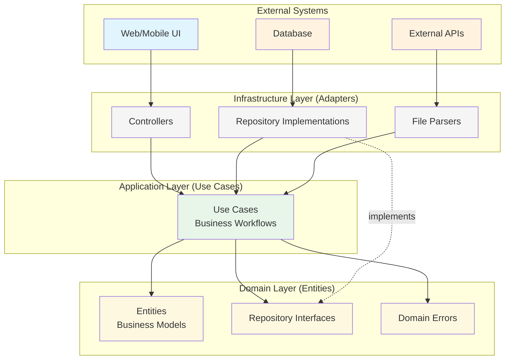
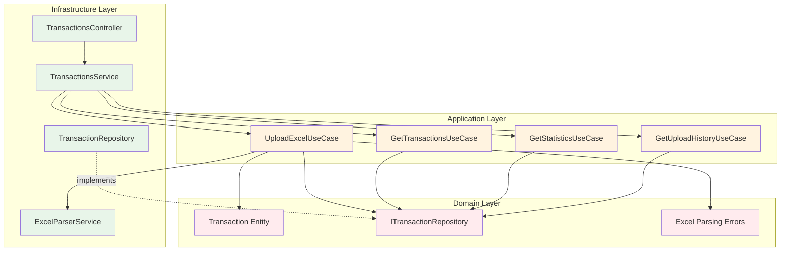
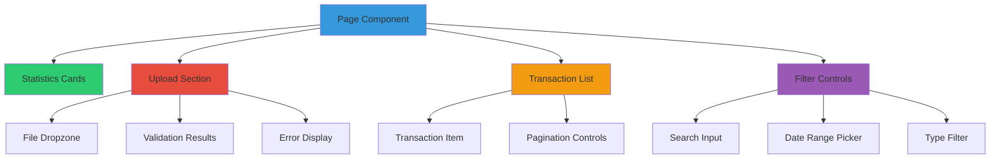
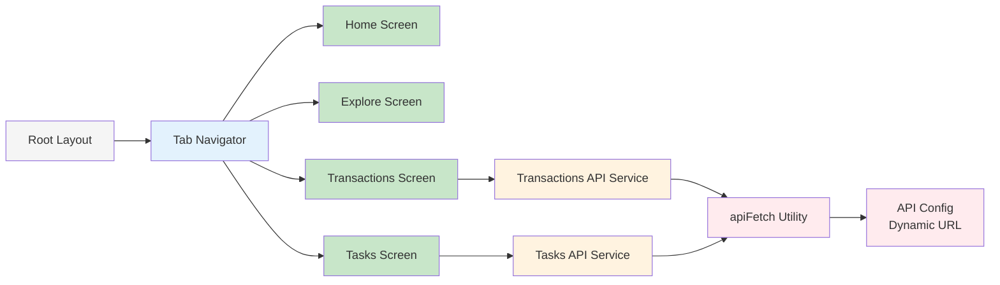
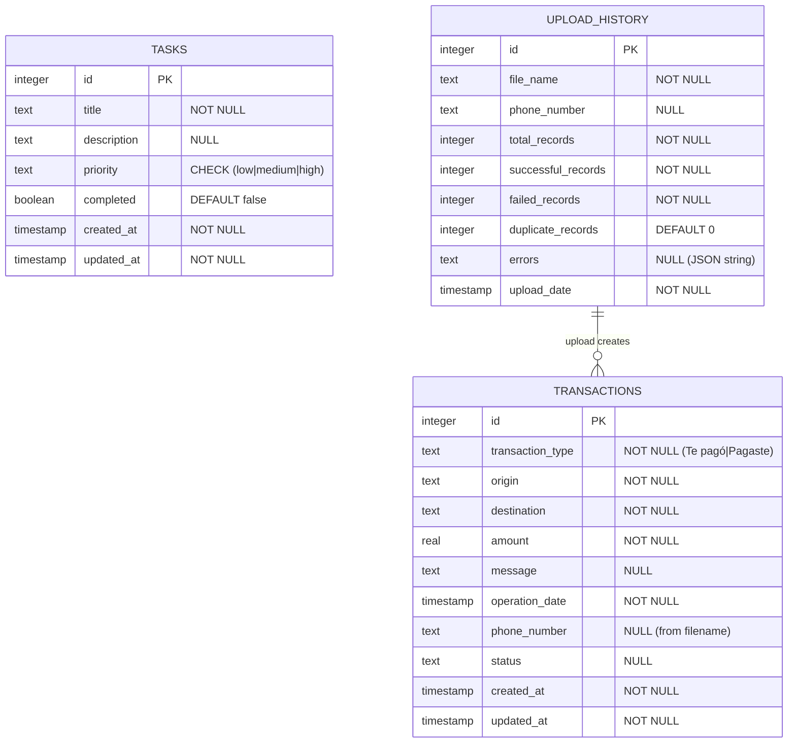
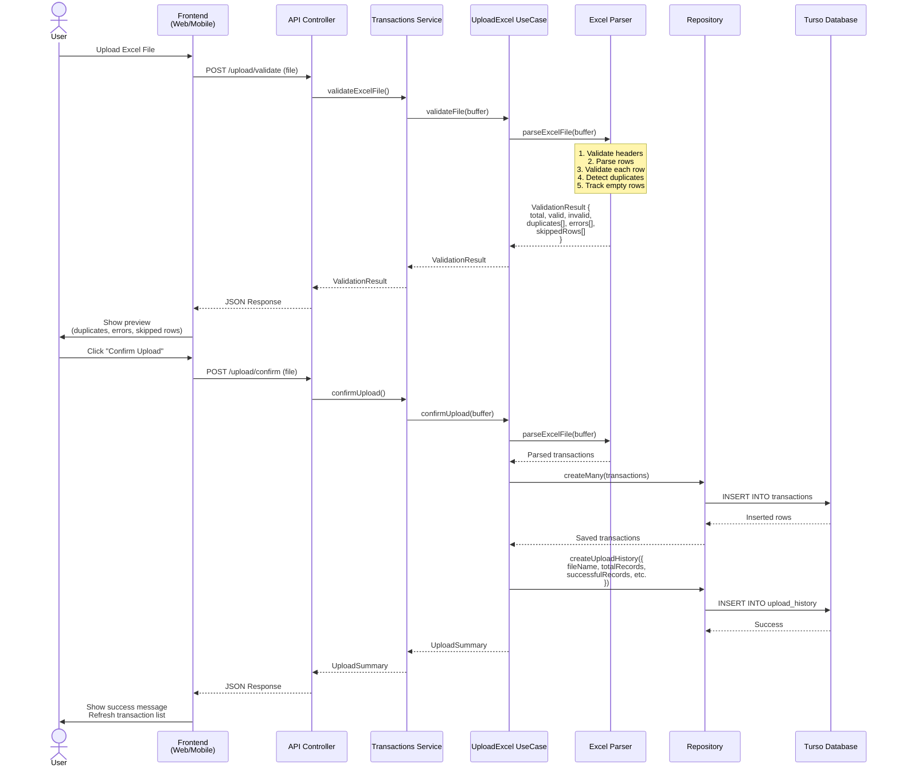
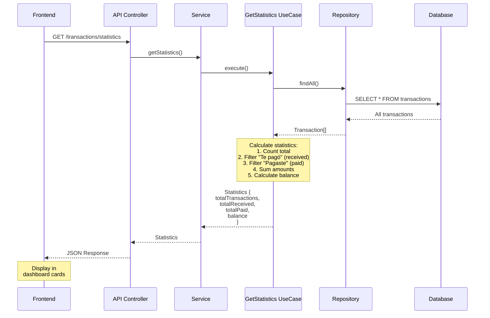
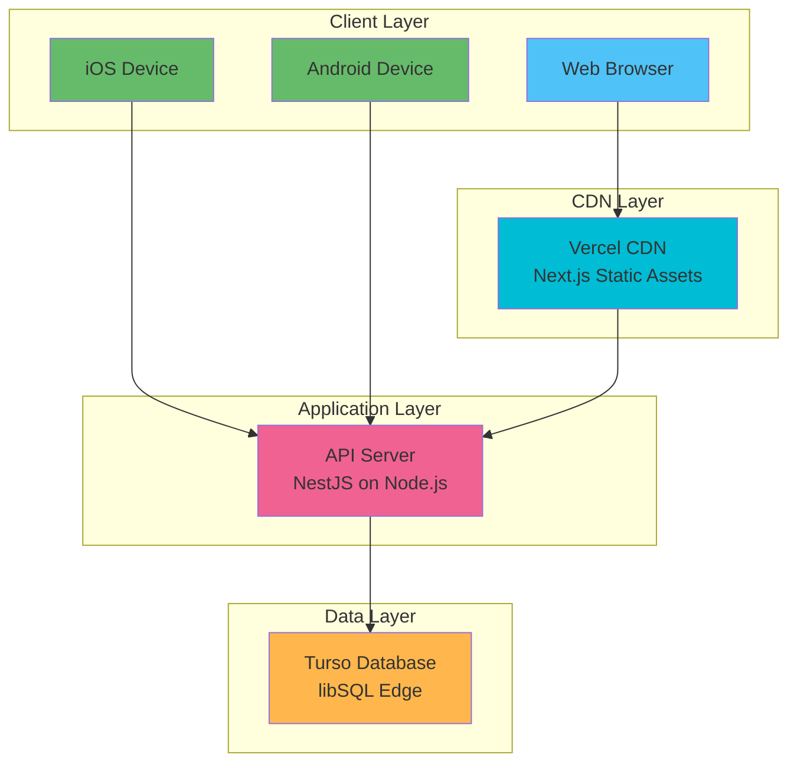

# Architecture Documentation

This document provides an in-depth look at the architecture, design patterns, and technical decisions behind the Home Store monorepo.

## Table of Contents

- [Overview](#overview)
- [Clean Architecture](#clean-architecture)
- [Monorepo Structure](#monorepo-structure)
- [Backend Architecture (API)](#backend-architecture-api)
- [Frontend Architecture](#frontend-architecture)
- [Database Design](#database-design)
- [Design Patterns](#design-patterns)
- [Data Flow Examples](#data-flow-examples)
- [Testing Strategy](#testing-strategy)
- [Performance Considerations](#performance-considerations)

## Overview

Home Store is built using **Clean Architecture** (also known as Hexagonal Architecture or Ports and Adapters). This architectural pattern ensures:

- **Independence from frameworks**: Business logic doesn't depend on NestJS, Next.js, or any other framework
- **Testability**: Business rules can be tested without UI, database, or external services
- **Independence from UI**: UI can change without changing business rules
- **Independence from database**: Can swap databases without affecting business logic
- **Independence from external agencies**: Business rules know nothing about the outside world

## Clean Architecture

### The Dependency Rule

> Source code dependencies must point inward, toward higher-level policies



### Layer Responsibilities

#### Domain Layer (Core Business Logic)

**Location**: `apps/api/src/{module}/domain/`

- **Entities**: Pure business objects with business rules
- **Repository Interfaces**: Contracts for data access
- **Domain Errors**: Custom exceptions for business rule violations

**Rules**:
- ✅ No dependencies on outer layers
- ✅ No framework dependencies
- ✅ Pure TypeScript/JavaScript
- ❌ Cannot reference Infrastructure or Application layers

**Example** (`transaction.entity.ts`):

```typescript
export class Transaction {
  private constructor(
    public readonly id: number,
    public readonly transactionType: string,
    // ... other properties
  ) {}

  static create(data: CreateTransactionData): Transaction {
    // Factory method with validation
    if (!data.amount || data.amount <= 0) {
      throw new InvalidAmountError();
    }
    return new Transaction(/* ... */);
  }

  // Business logic methods
  isReceived(): boolean {
    return this.transactionType === 'Te pagó';
  }

  isPaid(): boolean {
    return this.transactionType === 'Pagaste';
  }

  getFormattedAmount(): string {
    return `S/ ${this.amount.toFixed(2)}`;
  }
}
```

#### Application Layer (Use Cases)

**Location**: `apps/api/src/{module}/application/use-cases/`

- **Use Cases**: Orchestrate business workflows
- **DTOs**: Data transfer objects for use case inputs/outputs

**Rules**:
- ✅ Can depend on Domain layer
- ✅ Contains application-specific business rules
- ❌ Cannot depend on Infrastructure layer
- ❌ Framework-agnostic

**Example** (`upload-excel.use-case.ts`):

```typescript
export class UploadExcelUseCase {
  constructor(
    @Inject(TRANSACTION_REPOSITORY)
    private readonly repository: ITransactionRepository,
    private readonly parser: ExcelParserService,
  ) {}

  async validateFile(file: Buffer): Promise<ValidationResult> {
    // Orchestrate parsing and validation
    const result = await this.parser.parseExcelFile(file);

    // Business logic: detect duplicates
    const duplicates = this.findDuplicates(result.transactions);

    return { ...result, duplicates };
  }

  async confirmUpload(file: Buffer): Promise<UploadSummary> {
    // Parse, validate, and save
    const result = await this.validateFile(file);
    const saved = await this.repository.createMany(result.valid);
    await this.repository.createUploadHistory({
      totalRecords: result.total,
      successfulRecords: saved.length,
      // ...
    });

    return { savedCount: saved.length };
  }
}
```

#### Infrastructure Layer (Adapters)

**Location**: `apps/api/src/{module}/infrastructure/`

- **Controllers**: HTTP request handlers (NestJS)
- **Repositories**: Database access (Drizzle ORM)
- **Services**: External integrations (file parsing, APIs)

**Rules**:
- ✅ Can depend on all layers
- ✅ Framework-specific code
- ✅ Implements domain interfaces

**Example** (`transaction.repository.ts`):

```typescript
@Injectable()
export class TransactionRepository implements ITransactionRepository {
  constructor(@Inject(DATABASE) private readonly db: Database) {}

  async create(transaction: Transaction): Promise<Transaction> {
    const [row] = await this.db
      .insert(transactions)
      .values(this.toDbEntity(transaction))
      .returning();

    return this.toDomainEntity(row);
  }

  async findWithFilters(filters: TransactionFilters): Promise<Transaction[]> {
    let query = this.db.select().from(transactions);

    if (filters.transactionType) {
      query = query.where(eq(transactions.transactionType, filters.transactionType));
    }

    // ... more filters

    const rows = await query;
    return rows.map(this.toDomainEntity);
  }

  // Mapping methods
  private toDomainEntity(row: DbTransaction): Transaction {
    return Transaction.create({ /* map fields */ });
  }
}
```

## Monorepo Structure

```mermaid
graph TD
    ROOT[home-store<br/>Turborepo Root]

    ROOT --> APPS[apps/]
    ROOT --> PACKAGES[packages/]
    ROOT --> CONFIG[Configuration Files]

    APPS --> API[api/<br/>NestJS Backend]
    APPS --> WEB[web/<br/>Next.js]
    APPS --> MOBILE[mobile/<br/>Expo]

    API --> API_TASKS[tasks/<br/>Task Module]
    API --> API_TRANS[transactions/<br/>Transaction Module]
    API --> API_DB[database/<br/>DB Config]

    WEB --> WEB_PAGES[app/<br/>Pages]
    WEB --> WEB_COMP[components/<br/>Components]

    MOBILE --> MOBILE_TABS[app/(tabs)/<br/>Tab Screens]
    MOBILE --> MOBILE_SERV[services/<br/>API Services]

    PACKAGES --> PKG_API[@repo/api<br/>Shared DTOs]
    PACKAGES --> PKG_DB[@repo/database<br/>Drizzle Schemas]
    PACKAGES --> PKG_UI[@repo/ui<br/>Components]
    PACKAGES --> PKG_TS[@repo/typescript-config]
    PACKAGES --> PKG_ESLINT[@repo/eslint-config]
    PACKAGES --> PKG_VITEST[@repo/vitest-config]

    API -.depends on.-> PKG_API
    API -.depends on.-> PKG_DB
    WEB -.depends on.-> PKG_API
    WEB -.depends on.-> PKG_UI
    MOBILE -.depends on.-> PKG_API

    CONFIG --> TURBO[turbo.json]
    CONFIG --> PNPM[pnpm-workspace.yaml]
    CONFIG --> COMMITLINT[commitlint.config.js]

    style ROOT fill:#f5f5f5
    style APPS fill:#e3f2fd
    style PACKAGES fill:#fff3e0
    style API fill:#ffebee
    style WEB fill:#e8f5e9
    style MOBILE fill:#f3e5f5
```

### Package Dependencies

```mermaid
graph LR
    API[apps/api]
    WEB[apps/web]
    MOBILE[apps/mobile]

    PKG_API[@repo/api]
    PKG_DB[@repo/database]
    PKG_UI[@repo/ui]

    API --> PKG_API
    API --> PKG_DB
    WEB --> PKG_API
    WEB --> PKG_UI
    MOBILE --> PKG_API

    PKG_API -.exports DTOs.-> WEB
    PKG_API -.exports DTOs.-> MOBILE
    PKG_DB -.provides schemas.-> API

    style API fill:#e74c3c
    style WEB fill:#3498db
    style MOBILE fill:#9b59b6
    style PKG_API fill:#2ecc71
    style PKG_DB fill:#f39c12
    style PKG_UI fill:#1abc9c
```

## Backend Architecture (API)

### Module Structure

Each module follows Clean Architecture:

```
{module}/
├── domain/
│   ├── entities/
│   │   └── {entity}.entity.ts           # Pure business objects
│   ├── repositories/
│   │   └── {entity}.repository.interface.ts  # Repository contract
│   └── errors/
│       └── {module}.errors.ts            # Custom exceptions
│
├── application/
│   └── use-cases/
│       ├── create-{entity}.use-case.ts   # CRUD operations
│       ├── get-{entity}.use-case.ts
│       ├── update-{entity}.use-case.ts
│       └── delete-{entity}.use-case.ts
│
└── infrastructure/
    ├── repositories/
    │   └── {entity}.repository.ts        # Drizzle ORM implementation
    ├── {module}.controller.ts            # HTTP endpoints
    ├── {module}.service.ts               # Orchestration
    └── {module}.module.ts                # NestJS DI configuration
```

### Transactions Module Deep Dive



## Frontend Architecture

### Web Application (Next.js)

#### File-Based Routing (App Router)

```
app/
├── layout.tsx           # Root layout (fonts, metadata)
├── page.tsx             # Home page (/)
├── tasks/
│   └── page.tsx         # Tasks page (/tasks)
└── transactions/
    └── page.tsx         # Transactions page (/transactions)
```

#### Component Architecture



### Mobile Application (Expo)

#### Navigation Structure



#### API Configuration Pattern

The mobile app uses a dynamic API URL resolution system:

```typescript
// config/api.ts
function getApiUrl(): string {
  // 1. Check custom API URL in app config
  const customApiUrl = Constants.expoConfig?.extra?.API_URL;
  if (customApiUrl) return customApiUrl;

  // 2. For Expo Go development, use debugger host IP
  if (__DEV__) {
    const debuggerHost = Constants.expoConfig?.hostUri?.split(':').shift();
    if (debuggerHost) {
      return `http://${debuggerHost}:3000`;  // Computer's IP
    }

    // 3. Fallback for Android emulator
    if (Platform.OS === 'android') {
      return 'http://10.0.2.2:3000';
    }

    // 4. Fallback for iOS simulator
    return 'http://localhost:3000';
  }

  // 5. Production
  return 'https://api.your-domain.com';
}
```

This ensures the mobile app works correctly on:
- Physical devices (uses developer machine's IP)
- Android emulators (uses `10.0.2.2` alias)
- iOS simulators (uses `localhost`)
- Production (uses configured API URL)

## Database Design

### Entity Relationship Diagram



### Drizzle Schema Definition

```typescript
// transactions.schema.ts
export const transactions = sqliteTable('transactions', {
  id: integer('id', { mode: 'number' }).primaryKey({ autoIncrement: true }),
  transactionType: text('transaction_type').notNull(),
  origin: text('origin').notNull(),
  destination: text('destination').notNull(),
  amount: real('amount').notNull(),
  message: text('message'),
  operationDate: integer('operation_date', { mode: 'timestamp' }).notNull(),
  phoneNumber: text('phone_number'),
  status: text('status'),
  createdAt: integer('created_at', { mode: 'number' }).notNull(),
  updatedAt: integer('updated_at', { mode: 'number' }).notNull(),
});

// Inferred types
export type DbTransaction = typeof transactions.$inferSelect;
export type NewDbTransaction = typeof transactions.$inferInsert;
```

### Database Access Patterns

1. **Query Builder** (Drizzle):
   ```typescript
   const result = await db
     .select()
     .from(transactions)
     .where(eq(transactions.transactionType, 'Te pagó'))
     .orderBy(desc(transactions.operationDate))
     .limit(20);
   ```

2. **Type Safety**:
   - Select types: `DbTransaction`
   - Insert types: `NewDbTransaction`
   - Auto-completion for columns
   - Compile-time error checking

3. **Migration Strategy**:
   - **Development**: `pnpm db:push` (direct schema push)
   - **Production**: `pnpm db:migrate` (versioned migrations)

## Design Patterns

### 1. Repository Pattern

**Purpose**: Abstract data access logic

```typescript
// Domain layer (interface)
export interface ITransactionRepository {
  create(transaction: Transaction): Promise<Transaction>;
  findById(id: number): Promise<Transaction | null>;
  findWithFilters(filters: TransactionFilters): Promise<Transaction[]>;
  createMany(transactions: Transaction[]): Promise<Transaction[]>;
}

// Infrastructure layer (implementation)
@Injectable()
export class TransactionRepository implements ITransactionRepository {
  constructor(@Inject(DATABASE) private readonly db: Database) {}

  async create(transaction: Transaction): Promise<Transaction> {
    // Drizzle ORM implementation
  }
}

// Dependency Injection
@Module({
  providers: [
    {
      provide: TRANSACTION_REPOSITORY,
      useClass: TransactionRepository,
    },
  ],
})
```

**Benefits**:
- Swap database implementations without changing business logic
- Easy to mock for testing
- Domain layer stays pure

### 2. Factory Pattern

**Purpose**: Encapsulate object creation

```typescript
export class Transaction {
  private constructor(/* ... */) {}

  static create(data: CreateTransactionData): Transaction {
    // Validation
    if (!data.amount || data.amount <= 0) {
      throw new InvalidAmountError();
    }

    // Default values
    const createdAt = data.createdAt || Date.now();

    // Create instance
    return new Transaction(
      data.id,
      data.transactionType,
      data.origin,
      data.destination,
      data.amount,
      data.message,
      data.operationDate,
      data.phoneNumber,
      data.status,
      createdAt,
      createdAt,
    );
  }
}
```

**Benefits**:
- Centralized validation
- Consistent object creation
- Encapsulation of complexity

### 3. Use Case Pattern

**Purpose**: Encapsulate business workflows

```typescript
export class GetTransactionsUseCase {
  constructor(
    @Inject(TRANSACTION_REPOSITORY)
    private readonly repository: ITransactionRepository,
  ) {}

  async execute(filters: TransactionFilters): Promise<Transaction[]> {
    // Business logic
    const transactions = await this.repository.findWithFilters(filters);

    // Apply business rules
    return transactions.filter(t => t.amount > 0);
  }
}
```

**Benefits**:
- Single Responsibility Principle
- Testable in isolation
- Reusable across controllers

### 4. Dependency Injection

**Purpose**: Inversion of Control

```typescript
// Define token
export const TRANSACTION_REPOSITORY = 'TRANSACTION_REPOSITORY';

// Register in module
@Module({
  providers: [
    {
      provide: TRANSACTION_REPOSITORY,
      useClass: TransactionRepository,
    },
    UploadExcelUseCase,
  ],
})
export class TransactionsModule {}

// Inject in use case
export class UploadExcelUseCase {
  constructor(
    @Inject(TRANSACTION_REPOSITORY)
    private readonly repository: ITransactionRepository,
  ) {}
}
```

**Benefits**:
- Loose coupling
- Easy testing (inject mocks)
- Flexible configuration

## Data Flow Examples

### Transaction Upload Flow



### Statistics Calculation Flow



## Testing Strategy

### Test Pyramid

```
         /\
        /E2E\ ←── Few (Critical paths)
       /------\
      /Integration\ ←── Some (Module interactions)
     /------------\
    /  Unit Tests  \ ←── Many (Business logic)
   /----------------\
```

### Unit Tests (Vitest)

**What to Test**:
- Use cases
- Domain entities
- Business logic methods
- Validation functions

**Example**:
```typescript
describe('Transaction.create', () => {
  it('should create valid transaction', () => {
    const data = {
      transactionType: 'Te pagó',
      origin: 'John Doe',
      destination: 'Jane Doe',
      amount: 100,
      operationDate: new Date(),
    };

    const transaction = Transaction.create(data);

    expect(transaction.isReceived()).toBe(true);
    expect(transaction.getFormattedAmount()).toBe('S/ 100.00');
  });

  it('should throw error for negative amount', () => {
    expect(() => {
      Transaction.create({ amount: -10, /* ... */ });
    }).toThrow(InvalidAmountError);
  });
});
```

### E2E Tests (Supertest + Vitest)

**What to Test**:
- Full request/response cycles
- Database interactions
- Error handling

**Example**:
```typescript
describe('POST /transactions/upload/validate', () => {
  it('should validate excel file and return results', async () => {
    const file = readFileSync('test-file.xlsx');

    const response = await request(app.getHttpServer())
      .post('/transactions/upload/validate')
      .attach('file', file, 'test.xlsx')
      .expect(200);

    expect(response.body).toEqual({
      totalRecords: expect.any(Number),
      validRecords: expect.any(Number),
      duplicates: expect.any(Array),
      errors: expect.any(Array),
    });
  });
});
```

### Test Database

Uses **in-memory SQLite** for E2E tests:

```typescript
// vitest.config.e2e.ts
export default defineConfig({
  test: {
    env: {
      DATABASE_URL: ':memory:',
    },
  },
});
```

**Benefits**:
- Fast (no network I/O)
- Isolated (each test gets fresh DB)
- Deterministic (no external state)

## Performance Considerations

### Backend Optimizations

1. **Database Indexing** (Recommended):
   ```sql
   CREATE INDEX idx_operation_date ON transactions(operation_date);
   CREATE INDEX idx_transaction_type ON transactions(transaction_type);
   CREATE INDEX idx_amount ON transactions(amount);
   ```

2. **Pagination**:
   ```typescript
   const query = db
     .select()
     .from(transactions)
     .limit(filters.limit || 20)
     .offset((filters.page - 1) * filters.limit);
   ```

3. **Caching** (Future):
   - Cache statistics endpoint (Redis)
   - Cache-Control headers
   - ETag support

### Frontend Optimizations

1. **Next.js** (Web):
   - Turbopack for fast builds
   - Automatic code splitting
   - Image optimization

2. **React Native** (Mobile):
   - FlatList virtualization
   - Infinite scroll pagination
   - Pull-to-refresh
   - Debounced search (500ms)

3. **Shared**:
   - Type-safe API calls
   - Error boundaries
   - Loading states

### File Processing

**Excel Parser Optimization**:
- Stream processing for large files (future)
- Chunk validation
- Worker threads for CPU-intensive operations (future)

**Current Limitations**:
- Files loaded into memory buffer
- Suitable for files up to ~10MB
- For larger files, consider streaming

## Security Considerations

### Current Implementation

1. **Input Validation**:
   - Zod schemas validate all inputs
   - File type checking (.xlsx only)
   - Amount validation (positive numbers)

2. **Error Handling**:
   - Custom domain exceptions
   - No sensitive data in error messages
   - Structured error responses

### Recommendations

1. **Authentication** (Not Implemented):
   - JWT tokens
   - Role-based access control (RBAC)
   - Refresh token rotation

2. **Rate Limiting**:
   - File upload endpoint
   - API endpoints

3. **CORS**:
   - Configure allowed origins
   - Currently allows all (development)

4. **Input Sanitization**:
   - SQL injection prevention (Drizzle ORM)
   - XSS prevention (React escaping)

## Deployment Architecture



## Scaling Strategy

### Horizontal Scaling

API is stateless and can be horizontally scaled:

```
Load Balancer
    ├── API Instance 1
    ├── API Instance 2
    └── API Instance 3
         └── Turso (handles distribution)
```

### Vertical Scaling

- Increase Node.js memory limit
- Use clustering (PM2)
- Optimize database queries

### Microservices Evolution (Future)

```
Monolith (Current)
    └── API (Tasks + Transactions)

Microservices (Future)
    ├── Tasks Service
    ├── Transactions Service
    └── File Processing Service
```

---

## Conclusion

Home Store demonstrates a well-architected full-stack TypeScript application following Clean Architecture principles. The modular design ensures:

- **Maintainability**: Clear separation of concerns
- **Testability**: Business logic isolated from frameworks
- **Scalability**: Stateless design supports horizontal scaling
- **Type Safety**: End-to-end TypeScript with shared types
- **Developer Experience**: Hot reload, comprehensive documentation, modern tooling

For questions or contributions, refer to the main [README.md](./README.md).
