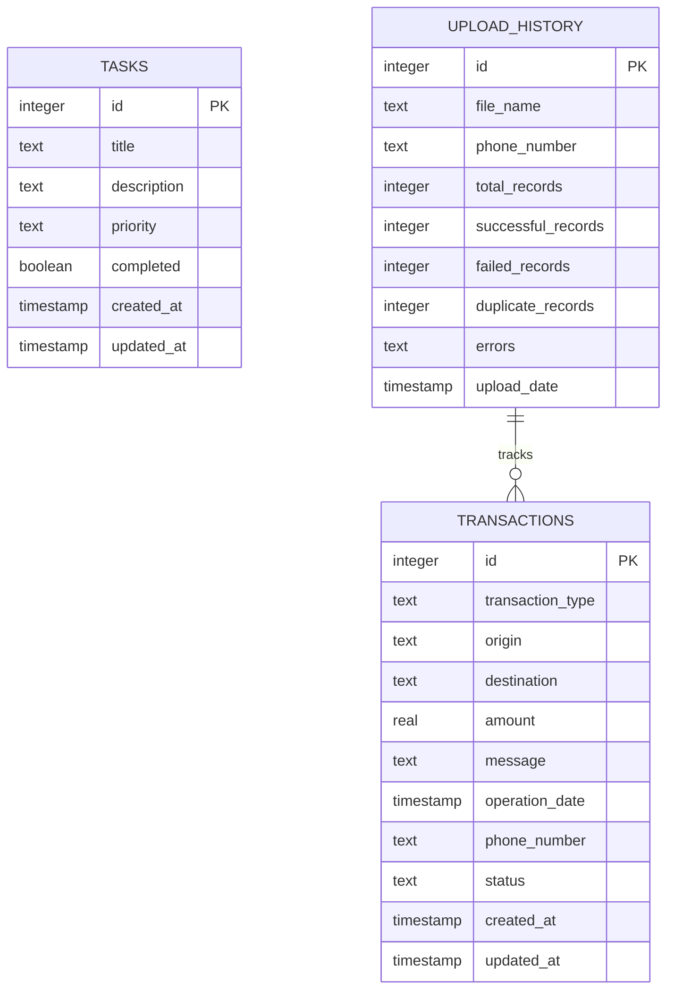
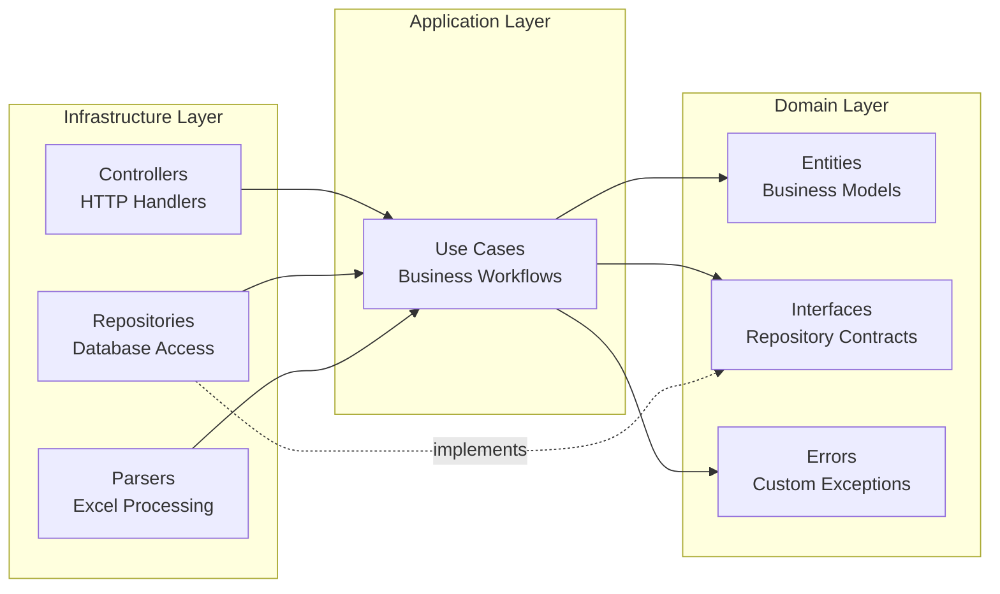

# Home Store

A full-stack TypeScript monorepo for managing transactions and tasks, featuring Excel import capabilities for Yape payment reports with comprehensive validation and duplicate detection.

## Overview

Home Store is a modern full-stack application built with **Clean Architecture** principles, providing:

- **Transaction Management**: Import and analyze Yape transaction reports from Excel files
- **Task Management**: Full CRUD operations for task tracking
- **Multi-Platform**: Web, mobile (iOS/Android), and REST API
- **Type-Safe**: End-to-end TypeScript with shared types across all apps
- **Developer-Friendly**: Turborepo monorepo with hot reload and fast builds

## Architecture

```mermaid
graph TB
    subgraph "Client Applications"
        WEB[Next.js Web App<br/>Port 3001]
        MOBILE[Expo Mobile App<br/>iOS/Android]
    end

    subgraph "Backend Services"
        API[NestJS API<br/>Port 3000]
        SWAGGER[Swagger Docs<br/>/api]
    end

    subgraph "Data Layer"
        DB[(Turso Database<br/>libSQL/SQLite)]
    end

    subgraph "Shared Packages"
        PKG_API[@repo/api<br/>DTOs & Types]
        PKG_DB[@repo/database<br/>Schemas]
        PKG_UI[@repo/ui<br/>Components]
    end

    WEB -->|HTTP/REST| API
    MOBILE -->|HTTP/REST| API
    API --> SWAGGER
    API --> PKG_API
    API --> PKG_DB
    WEB --> PKG_API
    MOBILE --> PKG_API
    PKG_DB --> DB
```

## Tech Stack

| Category | Technologies |
|----------|-------------|
| **Build System** | Turborepo 2.6.1, pnpm 8.15.5 |
| **Backend** | NestJS 11, Node.js ≥18 |
| **Frontend** | Next.js 16, React 19 |
| **Mobile** | Expo ~54, React Native 0.81 |
| **Database** | Turso (libSQL), Drizzle ORM 0.44.7 |
| **Testing** | Vitest 4.0.8 |
| **Validation** | Zod 4.1.12 |
| **API Docs** | Swagger/OpenAPI |

## Project Structure

```
home-store/
├── apps/
│   ├── api/              # NestJS backend API (Clean Architecture)
│   ├── web/              # Next.js web application
│   └── mobile/           # Expo React Native mobile app
│
└── packages/
    ├── @repo/api/        # Shared DTOs, entities, validation schemas
    ├── @repo/database/   # Drizzle ORM schemas and database config
    ├── @repo/ui/         # Shared React components
    ├── @repo/eslint-config/      # ESLint configurations
    ├── @repo/typescript-config/  # TypeScript configurations
    └── @repo/vitest-config/      # Vitest test configurations
```

## Quick Start

### Prerequisites

- **Node.js** ≥18
- **pnpm** 8.15.5 or later
- **Turso account** (for database) or use local SQLite

### Installation

```bash
# Clone the repository
git clone <repository-url>
cd home-store

# Install dependencies
pnpm install

# Set up environment variables
cp apps/api/.env.example apps/api/.env
# Edit apps/api/.env with your database credentials
```

### Environment Variables

Create `apps/api/.env`:

```bash
# Database Configuration
DATABASE_URL=libsql://your-database.turso.io
DATABASE_AUTH_TOKEN=your-auth-token

# For local development, you can use:
# DATABASE_URL=file:local.db
```

### Database Setup

```bash
# Navigate to API directory
cd apps/api

# Push schema to database (development)
pnpm db:push

# Or generate and run migrations (production)
pnpm db:generate
pnpm db:migrate
```

### Running the Applications

```bash
# From the root directory
# Start all apps (API, Web, Mobile) in development mode
pnpm dev
```

This will start:
- **API**: http://localhost:3000
- **Web**: http://localhost:3001
- **Mobile**: Expo Dev Server (scan QR code)
- **API Docs**: http://localhost:3000/api

### Running Individual Apps

```bash
# API only
cd apps/api && pnpm dev

# Web only
cd apps/web && pnpm dev

# Mobile only
cd apps/mobile && pnpm dev
```

## Key Features

### Transaction Management

- **Excel Import**: Upload Yape transaction reports (.xlsx files)
- **Validation**: Two-phase validation and confirmation process
- **Duplicate Detection**: Automatic detection based on date + amount + parties
- **Error Reporting**: Detailed row-by-row error information with reasons
- **Skipped Row Tracking**: See which empty rows were skipped and why
- **Statistics**: Real-time balance, total received, total paid
- **Filtering**: By type, date range, amount range, text search
- **Audit Trail**: Complete upload history with success/failure tracking

### Task Management

- **CRUD Operations**: Create, read, update, delete tasks
- **Priority Levels**: Low, medium, high
- **Status Tracking**: Completed/pending
- **Statistics**: Task counts by status and priority

### Multi-Platform

- **Web**: Full-featured Next.js application with drag-and-drop file upload
- **Mobile**: Native iOS/Android app with pull-to-refresh and infinite scroll
- **API**: RESTful API with comprehensive Swagger documentation

## Development

### Available Scripts

```bash
# Development
pnpm dev              # Start all apps in dev mode
pnpm dev:api          # Start API only
pnpm dev:web          # Start web only
pnpm dev:mobile       # Start mobile only

# Build
pnpm build            # Build all apps and packages
pnpm build:api        # Build API only

# Testing
pnpm test             # Run all tests
pnpm test:watch       # Watch mode
pnpm test:e2e         # E2E tests
pnpm test:coverage    # Generate coverage report

# Code Quality
pnpm lint             # Lint all apps
pnpm format           # Format all files with Prettier

# Database (from apps/api)
pnpm db:generate      # Generate Drizzle migrations
pnpm db:migrate       # Run migrations
pnpm db:push          # Push schema directly (dev)
pnpm db:studio        # Launch Drizzle Studio GUI
```

### Testing

This project uses **Vitest** for testing:

```bash
# Unit tests
cd apps/api
pnpm test

# E2E tests (uses in-memory database)
pnpm test:e2e

# Watch mode
pnpm test:watch

# Coverage
pnpm test:coverage
```

### Code Quality

The project enforces quality through:

- **Commitlint**: Conventional Commits format
- **Husky**: Pre-commit hooks
- **ESLint**: TypeScript and React best practices
- **Prettier**: Consistent code formatting

## API Endpoints

### Tasks

| Method | Endpoint | Description |
|--------|----------|-------------|
| POST | `/tasks` | Create new task |
| GET | `/tasks` | Get all tasks |
| GET | `/tasks/:id` | Get task by ID |
| PATCH | `/tasks/:id` | Update task |
| DELETE | `/tasks/:id` | Delete task |

### Transactions

| Method | Endpoint | Description |
|--------|----------|-------------|
| POST | `/transactions/upload/validate` | Validate Excel file (preview) |
| POST | `/transactions/upload/confirm` | Confirm and save transactions |
| GET | `/transactions` | Get transactions with filters |
| GET | `/transactions/statistics` | Get financial statistics |
| GET | `/transactions/upload-history` | Get upload audit trail |
| GET | `/transactions/:id` | Get transaction by ID |

**Query Parameters** for GET `/transactions`:
- `transactionType`: Filter by type ("Te pagó" or "Pagaste")
- `startDate`, `endDate`: ISO date strings
- `minAmount`, `maxAmount`: Number filters
- `search`: Text search across origin, destination, message
- `page`, `limit`: Pagination (default: page=1, limit=20)

## Database Schema



## Applications

### API (NestJS)

Clean Architecture implementation with three layers:
- **Domain**: Entities, repository interfaces, business logic
- **Application**: Use cases, business workflows
- **Infrastructure**: Controllers, repositories, parsers

[See detailed API documentation](./apps/api/README.md)

### Web (Next.js)

Next.js 16 with App Router, Tailwind CSS 4, and React 19.

Pages:
- **Home** (`/`): Dashboard with statistics
- **Tasks** (`/tasks`): Task management interface
- **Transactions** (`/transactions`): Transaction import and viewing

[See web app documentation](./apps/web/README.md)

### Mobile (Expo)

React Native app with Expo Router for navigation.

Screens:
- **Home**: Welcome screen
- **Explore**: Tutorial
- **Tasks**: Task management
- **Transactions**: Transaction viewing with infinite scroll

[See mobile app documentation](./apps/mobile/README.md)

## Shared Packages

### @repo/api
Shared TypeScript types, DTOs, and Zod validation schemas used by all apps.

### @repo/database
Drizzle ORM schemas and database configuration. Single source of truth for data models.

### @repo/ui
Shared React components (button, card, code).

### @repo/eslint-config, @repo/typescript-config, @repo/vitest-config
Shared configurations ensuring consistency across the monorepo.

## Architecture Patterns

### Clean Architecture (API)



**Benefits**:
- **Testability**: Business logic isolated from frameworks
- **Maintainability**: Clear separation of concerns
- **Flexibility**: Easy to swap implementations
- **Scalability**: Modular architecture supports growth

For detailed architecture documentation, see [ARCHITECTURE.md](./ARCHITECTURE.md)

## Production Deployment

### Build for Production

```bash
# Build all apps
pnpm build

# Outputs:
# - apps/api/dist/         NestJS compiled
# - apps/web/.next/        Next.js optimized
# - packages/*/dist/       Compiled TypeScript
```

### API Deployment

```bash
cd apps/api

# Run migrations
pnpm db:migrate

# Start production server
pnpm start:prod
```

### Web Deployment

Recommended: Deploy to **Vercel**
- Auto-deploy from GitHub
- Configure environment variables in dashboard
- Build command: `cd apps/web && pnpm build`

### Mobile Deployment

Use **EAS Build** for production builds:

```bash
cd apps/mobile
eas build --platform all
```

## Environment Variables Reference

### API (`apps/api/.env`)

```bash
# Required
DATABASE_URL=libsql://your-database.turso.io
DATABASE_AUTH_TOKEN=your-token

# Optional
NODE_ENV=development|production
PORT=3000
```

## Troubleshooting

### Mobile App Network Errors

If the mobile app shows "Network request failed":
1. Ensure API is running on port 3000
2. Check that `apiFetch` is being used (not hardcoded URLs)
3. Clear Metro cache: `pnpm dev --clear`

### Database Connection Issues

```bash
# Test database connection
cd apps/api
pnpm db:studio

# Reset local database
rm local.db
pnpm db:push
```

### Build Errors

```bash
# Clear Turborepo cache
rm -rf .turbo

# Clear all node_modules
rm -rf node_modules apps/*/node_modules packages/*/node_modules
pnpm install

# Rebuild packages first
cd packages/api && pnpm build
cd packages/database && pnpm build
```

## Contributing

1. Follow Conventional Commits format:
   - `feat:` New features
   - `fix:` Bug fixes
   - `docs:` Documentation
   - `refactor:` Code refactoring
   - `test:` Tests
   - `chore:` Maintenance

2. Run tests before committing:
   ```bash
   pnpm test
   pnpm lint
   ```

3. Ensure types are correct:
   ```bash
   pnpm check-types
   ```

## License

[Your License Here]

## Links

- **API Documentation**: http://localhost:3000/api (Swagger)
- **Architecture Details**: [ARCHITECTURE.md](./ARCHITECTURE.md)
- **Turborepo**: https://turborepo.com
- **NestJS**: https://nestjs.com
- **Next.js**: https://nextjs.org
- **Expo**: https://expo.dev
- **Drizzle ORM**: https://orm.drizzle.team
